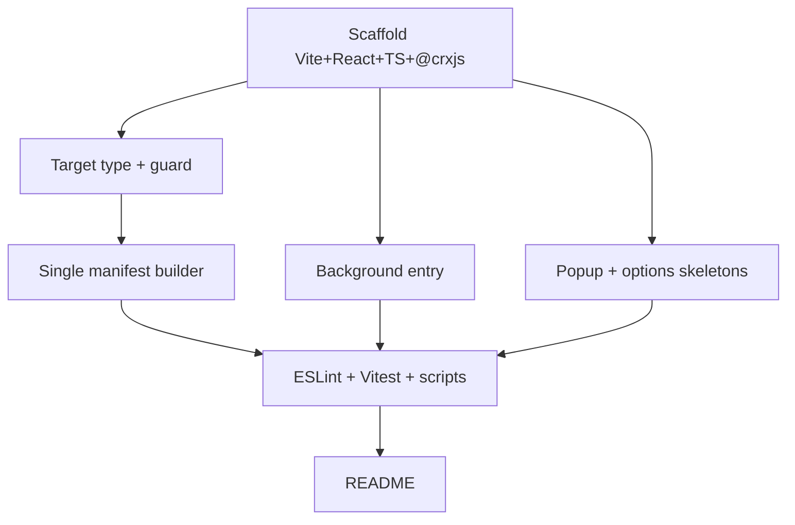

# Plan: Bootstrap - Dual-Browser WebExtension Scaffold

**Spec:** docs/features/20260709180625-bootstrap/spec.md
**Created:** 2026-07-09
**Estimated Effort:** ~0.5 day
**Status:** Implemented (as-built; scaffold merged on `main`)
**Coverage threshold:** none (scaffold; behavior tests arrive with features)

## 1. Overview

Create a runnable empty MV3 extension: Vite + `@crxjs/vite-plugin` build with a
`TARGET`-selected browser variant, a **single manifest source** that emits both the Chrome
(service_worker) and Firefox (scripts + gecko) manifests, React 18 popup/options skeletons,
an empty background entry, strict TypeScript, and Vitest. The key design choice is
**one typed manifest builder** (`buildManifest(target)`) instead of two hand-maintained
`manifest.json` files - it keeps the Chrome/Firefox divergence in one place and lets a test
pin both shapes. No product features.

## 2. Task Breakdown

| # | Task | Spec Ref | Files | Type | Est |
|---|------|----------|-------|------|-----|
| 1 | Scaffold Vite + React + strict TS; wire `@crxjs` with `build.outDir=dist/<target>` + `emptyOutDir` | AC-001, AC-002, AC-003 | `package.json`, `vite.config.ts`, `tsconfig.json`, `.gitignore` | impl | 1.5h |
| 2 | `Target` type + `isTarget` guard; build reads `process.env.TARGET`, throws on unknown | AC-007 | `src/shared/types.ts`, `src/shared/types.test.ts`, `vite.config.ts` | impl+test | 1h |
| 3 | Single manifest source: `buildManifest(target)` with a shared block + per-target `permissions`/`background`/gecko | AC-004, AC-005 | `src/manifest/index.ts`, `src/manifest/index.test.ts` | impl+test | 1.5h |
| 4 | Empty background entry (service worker / script) | AC-004 | `src/background/index.ts` | impl | 0.25h |
| 5 | React popup + options skeletons (html + main + App) | AC-006 | `src/ui/popup/*`, `src/ui/options/*` | impl | 1h |
| 6 | ESLint flat config (strict, `no-explicit-any`) + Vitest config; scripts `dev:*`/`build:*`/`typecheck`/`lint`/`test` | AC-008, AC-009 | `eslint.config.js`, `vitest.config.ts`, `package.json` | impl | 0.5h |
| 7 | README: build/dev commands + load-unpacked steps per browser | AC-002, AC-003, AC-006 | `README.md` | impl | 0.25h |

## 3. Execution Order

Spine: T1 -> T2 -> T3. Background entry, UI skeletons parallelize once T1 exists.

## 4. TDD Strategy

Config-heavy scaffold, so strict RED-first applies only where behavior exists (the target
guard and the manifest builder).

### RED (failing tests first)
- `shared/types.test.ts` - `isTarget` accepts `"chrome"`/`"firefox"`, rejects anything else (pins AC-007's guard).
- `manifest/index.test.ts` - `buildManifest("chrome")` yields `background.service_worker` + `declarativeNetRequest*` perms and **no** gecko block; `buildManifest("firefox")` yields `background.scripts` + `webRequest*` perms + a gecko id/`strict_min_version` (pins AC-004, AC-005).

### GREEN
- Implement `isTarget` and `buildManifest` minimally until both suites pass.

### REFACTOR
- Extract the shared manifest block (`SHARED`) and the `byTarget` record; `satisfies` for the checked-but-inferred shape.

## 5. File Changes

### New
- `package.json`, `vite.config.ts`, `tsconfig.json`, `.gitignore` - tooling
- `mise.toml` - node 22 pin
- `eslint.config.js`, `vitest.config.ts` - lint + test config
- `src/manifest/index.ts` (+ `index.test.ts`) - dual-browser manifest builder
- `src/shared/types.ts` (+ `types.test.ts`) - `Target` + `isTarget`
- `src/background/index.ts` - empty background entry
- `src/ui/popup/{index.html,main.tsx,App.tsx}`, `src/ui/options/{index.html,main.tsx,App.tsx}` - skeletons
- `README.md` - run + load instructions

### Modified
- None (fresh scaffold).

### Deleted
- None.

## 6. Key Decisions (for ADR/Decision Log)

- **Single typed manifest source (`buildManifest(target)`)** vs two hand-written `manifest.json` files. Rationale: keeps the Chrome/Firefox divergence (background shape, permissions, gecko settings) in one place, testable, and impossible to let drift.
- **`TARGET` env var selects the build variant**, output to `dist/<target>`, unknown value throws. Rationale: one command set per browser (`dev:chrome`/`build:firefox`), fail-fast instead of silently shipping the wrong manifest.
- **`webextension-polyfill` for the extension API** vs raw `chrome.*`. Rationale: promise-based, normalizes the Chromium/Firefox namespace gap; the whole codebase imports `browser` from it.
- **Vitest as the sole test layer** (no Playwright yet). Rationale: pure logic + React components cover the scaffold; a real-browser E2E layer is deferred until there's interception to drive.

## 7. Risks and Mitigations

| Risk | Impact | Mitigation |
|------|--------|------------|
| `@crxjs/vite-plugin` v2 is beta | API churn on upgrade | Pin the version; isolate all crx usage in `vite.config.ts`. |
| MV3 background differs (Chrome service_worker vs Firefox scripts) | Wrong manifest fails to load | `buildManifest` branches on target; a test pins both shapes (AC-004). |
| Firefox rejects a manifest lacking gecko id | Temporary add-on won't load | gecko `id` + `strict_min_version: 128.0` baked into the Firefox variant (AC-004). |
| Silent wrong-target build | Ships Chrome manifest as Firefox | Unknown `TARGET` throws before any output (AC-007, TC-003). |

## 8. Acceptance Verification

| AC | Criterion | Test(s) / Evidence | Status |
|----|-----------|--------------------|--------|
| AC-001 | Clean install | `npm install` (lockfile committed) | Met |
| AC-002 | Chrome build loadable | `npm run build:chrome` -> `dist/chrome`; TC-001 | Met |
| AC-003 | Firefox build loadable | `npm run build:firefox` -> `dist/firefox`; TC-002 | Met |
| AC-004 | Dual manifest from one source | `src/manifest/index.test.ts` | Met |
| AC-005 | Per-engine permissions | `src/manifest/index.test.ts` | Met |
| AC-006 | Popup + options render | TC-001, TC-002 (manual load) | Met |
| AC-007 | Unknown target fails fast | `src/shared/types.test.ts` + `vite.config.ts` guard; TC-003 | Met |
| AC-008 | typecheck + lint + test green | `npm run typecheck` / `npm run lint` / `npm test` (suite green) | Met |
| AC-009 | Dev HMR per target | `dev:chrome` / `dev:firefox` scripts | Met |

### Deviations from plan

- Documented retroactively: the scaffold shipped ahead of this feature folder, so all rows are **Met** rather than Pending. Later features (rules, engines, page patch, DevTools panel, Tailwind/shadcn) were layered on top and are tracked separately, not here.
