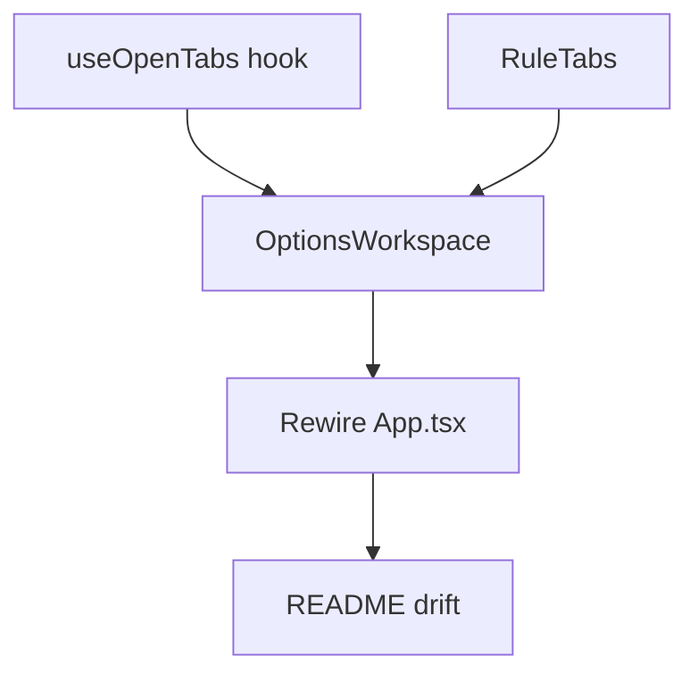

# Plan: Layout - Options Page Master-Detail Shell

**Spec:** docs/features/20260710120113-layout/spec.md
**Created:** 2026-07-10
**Estimated Effort:** ~0.5 day
**Status:** Implemented (verified; awaiting user validation before commit)
**Coverage threshold:** 90% (lines/functions/branches/statements) on `src/ui/shared/**`

## 1. Overview

Re-parent the existing options-page pieces into a master-detail shell. The tab model is
the only new logic; it is extracted into a **pure, testable hook** (`useOpenTabs`) so the
90% `src/ui/shared` coverage gate is met without DOM gymnastics. Presentation is split into
small components (`RuleTabs`, `OptionsWorkspace`) that reuse `RuleList` (sidebar) and
`RuleForm` (editor) unchanged. No storage, no dirty-tracking.

Domain-modeling gate: **neither `pz-ddd` nor `pz-archetypes` applies** - this is pure
presentation/layout, no domain model, boundary, or recurring domain shape. (Recorded in
Decision Log.)

## 2. Task Breakdown

| # | Task | Spec Ref | Files | Type | Est |
|---|------|----------|-------|------|-----|
| 1 | `useOpenTabs(ruleIds)` hook: open/close/setActive + prune-on-rules-change + adjacent-on-close | AC-003,006,007,010,011, E-1,E-2 | `src/ui/shared/useOpenTabs.ts` (+ test) | impl+test | 2h |
| 2 | `RuleTabs` strip component (tabs, active underline, close control, horizontal scroll) | AC-004,007, E-4 | `src/ui/shared/RuleTabs.tsx` (+ test) | impl+test | 1.5h |
| 3 | `OptionsWorkspace` shell: top toolbar + sidebar (`RuleList`) + right area (tabs/editor/empty) | AC-001,002,005,008,009,012 | `src/ui/shared/OptionsWorkspace.tsx` (+ test) | impl+test | 2h |
| 4 | Rewire `options/App.tsx` to render `OptionsWorkspace` inside `RulesProvider` | AC-001 | `src/ui/options/App.tsx` | impl | 0.5h |
| 5 | Doc drift check (README options-page description) | - | `README.md` | impl | 0.25h |

## 3. Execution Order

Spine: T1 -> T3 -> T4. `RuleTabs` (T2) parallelizes with the hook.

## 4. TDD Strategy

### RED (failing tests first)
- `useOpenTabs`: open adds+activates; re-open dedupes (AC-006); close active picks adjacent, close non-active keeps active (AC-007); rules-change prunes missing ids and fixes active (AC-010); draft sentinel dedupes (E-1); initial state empty (AC-011).
- `RuleTabs`: renders a tab per key with label; click activates (`onActivate`); close control fires `onClose` with the key; active tab marked.
- `OptionsWorkspace`: sidebar lists all rules while editing (AC-002); open-from-sidebar shows editor (AC-003); Add rule opens draft (AC-005); empty state when no tabs (AC-008); save/cancel closes tab (AC-009); delete-open-rule prunes tab (AC-010). Reuse the `createFakeGateway` pattern from `RuleList.test.tsx`.

### GREEN
- Implement each unit minimally to pass. Prefer behavior assertions (visible editor, active tab, gateway calls) over spying internals.

### REFACTOR
- Extract the adjacent-index helper if it clutters; keep `useOpenTabs` free of DOM refs. Ensure no `any`, guards over nesting.

## 5. File Changes

### New
- `src/ui/shared/useOpenTabs.ts` (+ `.test.ts`) - tab-state hook
- `src/ui/shared/RuleTabs.tsx` (+ `.test.tsx`) - tab strip
- `src/ui/shared/OptionsWorkspace.tsx` (+ `.test.tsx`) - master-detail shell

### Modified
- `src/ui/options/App.tsx` - render `OptionsWorkspace` (moves the `Manager` body out of App)
- `README.md` - update the options-page sentence to describe the master-detail layout

### Deleted
- None (the old `Manager` inline block in `App.tsx` is replaced, not a separate file).

## 6. Key Decisions (for Decision Log)

- **Tab state in a pure `useOpenTabs` hook** (vs inline `useState` in the shell). Rationale: satisfies the 90% coverage gate with fast unit tests and isolates the only real logic from the DOM.
- **Tab key = rule id, with a `"new:draft"` sentinel** for the single unsaved draft. Rationale: one flat keyspace; dedupe + prune fall out of a set/array of keys.
- **Prune tabs via an effect on the rules list** (vs an explicit delete callback). Rationale: one code path covers both AC-010 (delete) and stale ids; the sidebar's existing delete flow stays untouched.
- **No persistence, no dirty-tracking** - deferred to `.pzielinski/backlog.md`. Rationale: keeps this a layout-only change (per the approved brainstorm).

## 7. Risks and Mitigations

| Risk | Impact | Mitigation |
|------|--------|------------|
| `RuleForm.onDone` semantics change (now closes a tab) | Save/cancel might not close | Wire `onDone` -> `close(activeKey)`; assert in `OptionsWorkspace` test (AC-009). |
| Prune effect loops / fights active selection | Flicker or wrong active tab | Hook test drives rules-change directly and asserts final `openKeys`/`activeKey`. |
| jsdom lacks scroll APIs for the tab strip | Test noise | Strip uses CSS `overflow-x-auto` only; no scroll API calls, nothing to stub. |

## 8. Acceptance Verification

| AC | Criterion | Test(s) / Evidence | Status |
|----|-----------|--------------------|--------|
| AC-001 | Master-detail shell renders | `OptionsWorkspace.test`: "should render the top toolbar…" | Met |
| AC-002 | Sidebar always visible | `OptionsWorkspace.test`: "should keep the full rule list… while a rule is being edited" | Met |
| AC-003 | Open from sidebar -> active tab | `OptionsWorkspace.test`: "should open a rule from the sidebar as an active editor tab" | Met |
| AC-004 | Tab strip + click activates | `RuleTabs.test` (render/activate/aria-current) + `OptionsWorkspace.test`: "should open two rules and switch…" | Met |
| AC-005 | Add rule -> draft tab | `OptionsWorkspace.test`: "should open an empty draft editor when Add rule is clicked" | Met |
| AC-006 | Re-open dedupes | `useOpenTabs.test`: "should not duplicate…" + `OptionsWorkspace.test`: "should not open a duplicate tab…" | Met |
| AC-007 | Close active/non-active behavior | `useOpenTabs.test` (prev/next/null/non-active) + `RuleTabs.test`: "should not call onActivate if the close control…" | Met |
| AC-008 | Empty state | `OptionsWorkspace.test`: "should show the empty-state hint…" + "…from the empty-state New rule button" | Met |
| AC-009 | Save/cancel closes tab | `OptionsWorkspace.test`: "should persist and close…" + "should close the tab without persisting when… cancelled" | Met |
| AC-010 | Delete prunes open tab | `useOpenTabs.test` (prune-active) + `OptionsWorkspace.test`: "should prune the tab of a rule deleted…" | Met |
| AC-011 | Session-only (no persist) | `useOpenTabs.test`: "should start with no open tabs…" + `OptionsWorkspace.test`: "should start with no tabs open after a fresh remount" | Met |
| AC-012 | Sidebar ops still work | Existing `RuleList.test` (13 tests) stay green | Met |

Verification (2026-07-10): `npm run typecheck` exit 0, `npm run lint` exit 0, `npm run test:coverage` exit 0 - 389 tests pass; coverage gate (90%) met on `src/ui/shared/**` (useOpenTabs.ts + RuleTabs.tsx 100%, OptionsWorkspace.tsx 100% lines).

### Deviations from plan

- Added 3 UI-state tests (loading / error / diagnostics) + 1 edge-case test (E-1: Add rule twice = single draft, red-green proven) to `OptionsWorkspace.test.tsx` - beyond the planned per-AC set, to cover spec §4 states and close the coverage gap on the moved diagnostics/loading branches.
- Touched `src/ui/shared/useTheme.ts` (defensive `stored?.[key]` + `.catch`) - the new `OptionsWorkspace` mount surfaced an unhandled-rejection path in `useTheme` under test teardown; minimal hardening, all gates green.
