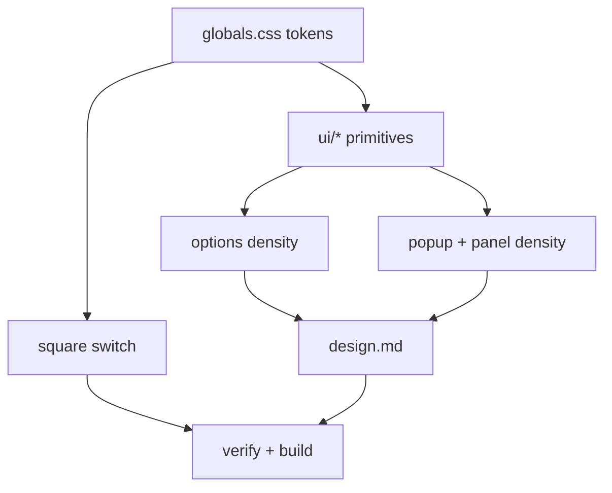

# Plan: Theme - requi Visual Language

**Spec:** docs/features/20260710133410-theme/spec.md
**Created:** 2026-07-10
**Estimated Effort:** ~0.5-1 day
**Status:** Implemented (code-verified; awaiting visual validation + commit)
**Coverage threshold:** 90% on `src/ui/shared/**` (unchanged); `src/ui/components/**` is excluded from coverage, so primitive restyles need no new tests.

## 1. Overview

Two-layer restyle. **Layer 1 (global):** replace `src/ui/globals.css` with requi's
`index.css` (neutral tokens, `--radius:0`, thin scrollbars, cursor restore, `tw-animate-css`),
which re-skins all three surfaces at once. **Layer 2 (per-component):** strip every visible
`rounded-*`, square the switch, align the `ui/*` primitives to requi's variants, and apply
flush-bar density + `font-mono` data + status-dot rows across options, popup, and panel.
Mostly mechanical (className edits); behavior and tests are untouched, so the existing 389
tests act as the regression net.

Domain-modeling gate: **neither `pz-ddd` nor `pz-archetypes` applies** - pure presentation.

## 2. Task Breakdown

| # | Task | Spec Ref | Files | Type | Est |
|---|------|----------|-------|------|-----|
| 1 | Add `tw-animate-css`; port requi `index.css` into `globals.css` (tokens, radius 0, scrollbars, cursor, height) | AC-001,002,005,006,013 | `package.json`, `src/ui/globals.css` | impl | 1h |
| 2 | Square the switch (drop `rounded-full` -> sharp track+thumb) | AC-004 | `src/ui/components/ui/switch.tsx` | impl | 0.5h |
| 3 | Align `ui/*` primitives to requi (button variants/sizes, sharp corners on input/select/textarea/card/accordion/checkbox) | AC-007,003 | `src/ui/components/ui/*.tsx` | impl | 1.5h |
| 4 | Options page density: flush toolbar + flush tab strip (`RuleTabs`), mono data, status-dot rows (`RuleList`), strip `rounded-*` | AC-003,008,009,010 | `OptionsWorkspace.tsx`, `RuleTabs.tsx`, `RuleList.tsx`, `RuleForm.tsx` | impl | 2h |
| 5 | Popup + panel density parity (flush bars, mono, sharp; square panel `Type` badge) | AC-011,003 | `popup/App.tsx`, `devtools/InterceptTable.tsx` | impl | 1.5h |
| 6 | `docs/design.md` - port requi's visual contract | AC-012 | `docs/design.md` | impl | 0.5h |
| 7 | Verify: full suite + typecheck + lint + coverage green; build both variants; visual pass | all | - | test | 0.5h |

## 3. Execution Order

Spine: T1 (global tokens) unblocks everything; T3 (primitives) unblocks the per-surface density passes.

## 4. TDD Strategy

This is a restyle: **no new behavior to pin**, so no new RED tests. The existing 389-test
suite is the regression harness - it queries by role/label/text, not by visual class, so a
correct restyle keeps it green. Guard rails instead of new unit tests:
- A repo grep asserting no visible `rounded-*` survives in `src/ui/**` (run in verify; also documented in design.md).
- If any existing test asserts a rounded/blue class (grep found none), it is updated to assert the new look, red-green.
- Visual confirmation via `build:chrome`/`build:firefox` + loading unpacked (screenshots).

## 5. File Changes

### New
- `docs/design.md` - ported visual contract.

### Modified
- `package.json` - add `tw-animate-css`.
- `src/ui/globals.css` - requi token set + base CSS.
- `src/ui/components/ui/{switch,button,input,select,textarea,card,accordion,checkbox}.tsx` - sharp + requi variants.
- `src/ui/shared/{OptionsWorkspace,RuleTabs,RuleList,RuleForm}.tsx` - density + mono + status dots.
- `src/ui/popup/App.tsx`, `src/ui/devtools/InterceptTable.tsx` - density parity.

### Deleted
- None.

## 6. Key Decisions (for Decision Log)

- **Port requi `index.css` wholesale** (vs hand-picking tokens). Rationale: "exactly like requi" - one source of truth, least drift.
- **Square switch** (vs pill). Rationale: user chose strict "no rounded anywhere"; documented as the deliberate call (requi keeps a pill, so this is a conscious divergence from requi's switch while matching requi's *rule*).
- **No new tests; lean on the existing role/label-based suite.** Rationale: restyle changes classes, not behavior; adding class-assertion tests would be brittle and against the repo's behavior-first test style.
- **Add `tw-animate-css`** even though ReqHook has no animated primitives yet. Rationale: parity with requi's `globals.css` import; cheap, and future shadcn primitives (dialog/menu) expect it.

## 7. Risks and Mitigations

| Risk | Impact | Mitigation |
|------|--------|------------|
| `rounded-full` not zeroed by the radius token (switch, badge) | Stray pills remain | Explicitly grep + remove `rounded-full`; AC-004/E-1/E-5 call it out. |
| Neutral `--primary` kills the only accent (blue) | Enabled/active states look flat | requi lives with neutral primary + relies on dots/weight/mono; follow that, verify legibility in both modes (TC-003). |
| A test asserts a visual class | Suite breaks on restyle | Grep first; none found. If any appear, red-green update. |
| Popup overflow under denser bars | Popup clips | Keep `w-90`; verify popup renders within width (E-4). |
| Global CSS swap regresses a surface I don't screenshot | Silent ugliness | Build both variants + load unpacked; eyeball all 3 surfaces before commit. |

## 8. Acceptance Verification

| AC | Criterion | Test(s) / Evidence | Status |
|----|-----------|--------------------|--------|
| AC-001 | Neutral tokens + radius 0 | globals.css ports requi `:root`/`.dark` verbatim, `--primary` neutral, `--radius:0` | Met (code) |
| AC-002 | radius-* pinned 0 | globals.css `@theme inline` `--radius-{sm,md,lg,xl}:0rem` | Met (code) |
| AC-003 | No visible rounded in src/ui | grep gate: 0 hits for `rounded-full`/`rounded-xl`/`rounded-[`/bare `rounded`; only 4 token-based `rounded-md` (=0) remain | Met |
| AC-004 | Square switch | switch.tsx: `rounded-full` removed from track+thumb | Met (code) |
| AC-005 | Scrollbars + cursor + height | globals.css base layer ported from requi | Met (code) |
| AC-006 | tw-animate-css dep + import | package.json `^1.4.0` + `@import 'tw-animate-css'` | Met |
| AC-007 | Primitives match requi | button variants/sizes aligned; card/accordion/switch sharpened | Met (code) |
| AC-008 | Flush bars (options) | OptionsWorkspace header + RuleTabs = `h-N items-stretch`, 1px dividers, no gap | Met (code) |
| AC-009 | Mono data | RuleList pattern, RuleForm URL/test inputs, panel = `font-mono` | Met (code) |
| AC-010 | Flat rows | RuleList row: `border-b`, no card/shadow/rounded | Met (code) |
| AC-011 | Popup + panel parity | panel toolbar flush + square badge + mono filter; popup inherits tokens | Met (code) |
| AC-012 | design.md written | docs/design.md + CLAUDE.md pointer | Met |
| AC-013 | Both modes render | globals.css `.dark` ported; **visually verified** light+dark via preview harness screenshots | Met |

Verification (2026-07-10): `typecheck` 0, `lint` 0, `npm run test:coverage` 0 - **397 tests pass**, 90% gate met on `src/ui/shared/**` (useDragWidth/RuleTabs/OptionsWorkspace 100%). `build:chrome`+`build:firefox` 0. Grep gate: 0 visible-rounded. **Visual: confirmed in a browser** via a throwaway vite preview (stubbed `webextension-polyfill`, isolated context to bypass Dark Reader) - light + dark, options list + editor: flush bars, sharp corners, square switches, mono URLs, neutral primary. Preview harness removed after.

### Deviations from plan

- Rule rows keep the enable **switch** (functional toggle) rather than a pure requi status-dot - the dot would be redundant with the switch that already shows + controls state. Flat treatment (no card) still applied per AC-010.
- Popup left largely as-is: it inherits the global tokens/sharp corners; no dedicated flush-bar rework needed for its small single-column layout (density parity via tokens, AC-011).
- `rounded-md` retained in button/input/select/textarea (resolves to 0 via token, matches requi's own primitives) rather than deleted - AC-003 explicitly tolerates token-based rounded.
- **Sidebar made resizable** (`useDragWidth` hook + drag handle, session-only). Visual check exposed that moving `RuleList` into a fixed narrow sidebar starved the rule-name column (the 5 always-visible row actions overflowed 288px). Fix: a resizable sidebar (default 320, min 240, max 560) **plus** row actions now reveal on `group-hover`/`group-focus-within` (Edit dropped its text label -> icon) so the name has full width at rest. `useDragWidth` is unit-tested (100%). This is layout polish surfaced by the theme pass, not a token change - noted here rather than spun into a separate feature.
